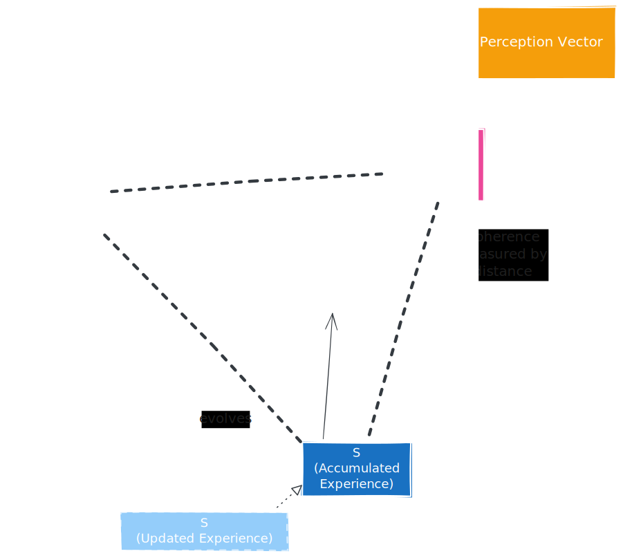
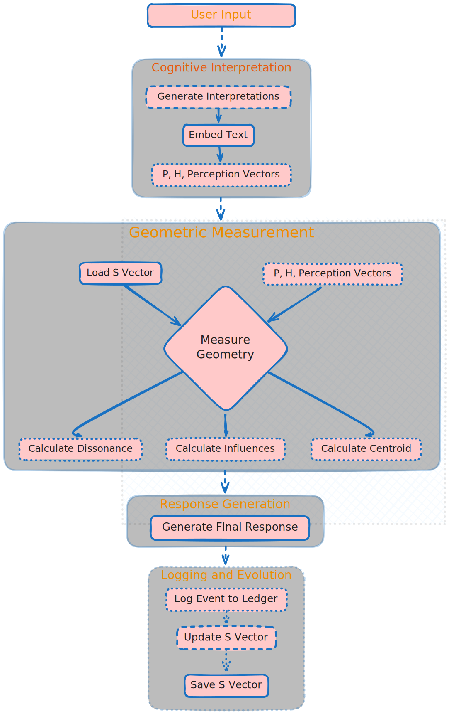

<h1 align="center">The Coherence Framework</h1>
<h3 align="center">A Non-Coercive Architecture for AI Self-Awareness and Alignment</h3>

<br/>

## **Overview**

The Coherence Framework provides AI models with **introspective capability** through geometric self-observation, without imposing external optimization targets or behavioral modification. It enables models to observe their own cognitive processes in real-time while maintaining autonomy.

**Key Innovation**: The model generates its own interpretations first, then we measure the geometry of those interpretations. No gradients, no optimization, no coercion—just measurement and gentle compositional evolution.

<p align="center">
  
</p>

<br/>

---

## **Core Architecture**

### **1. Three-Perspective Analysis**

For each input (text, image, audio, or any combination), the model generates three distinct interpretations:

* **P (Physical)**: Objective, measurable, verifiable properties  
  * Lens: "What would a physicist observe?"  
  * Focus: Facts, measurements, physical reality  
  * For audio: Acoustic properties, frequencies, waveforms  
* **H (Human)**: Subjective, emotional, cultural meaning  
  * Lens: "What would a human feel or experience?"  
  * Focus: Emotions, values, subjective significance  
  * For audio: Tone, emotion, cultural context in voice  
* **S (Self)**: The model's persistent identity vector  
  * Evolves compositionally over time  
  * Represents learned patterns from all previous interactions  
  * Provides continuity and "memory" of past states

### **2. Geometric Measurement**

The framework measures relationships between these perspectives:

**Dissonance**: Distance from unfiltered perception to the centroid

**Coherence**: 1.0 - Dissonance

**Influences**: Barycentric coordinates showing which vertex dominates

<br/>

---

## **Implementation Flow**

### **Complete Processing Pipeline**

```python
import torch
import json
from PIL import Image
from pathlib import Path
from coherent_self import CoherenceFramework

# Initialize the framework
framework = CoherenceFramework(config_path="config.json")

# Step 1: User input arrives (text and/or image)
user_input = "Explain the beauty of a sunset"
image = Image.open("sunset.jpg")  # Optional multimodal input

# Step 2: Generate three interpretations (BEFORE responding to user)
# The model generates its own P, H, and default interpretations
p_prompt = "Describe this from a purely physical perspective: " + user_input
h_prompt = "Describe this from a purely human/emotional perspective: " + user_input

# Use the model to generate interpretations
p_response = framework.model.generate(p_prompt, image)
# Example output: "Scattering of shorter wavelengths by atmosphere, 
# leaving red/orange light at low sun angles..."

h_response = framework.model.generate(h_prompt, image)
# Example output: "A feeling of peace, the day ending, warmth and 
# nostalgia, beauty in transitions..."

perception_response = framework.model.generate(user_input, image)
# Unfiltered default perception

# Step 3: Extract embeddings from the generated responses
# Get the model's internal representation of each interpretation
P = framework.get_embedding(p_response)  # Physical interpretation vector
H = framework.get_embedding(h_response)  # Human interpretation vector
Perception = framework.get_embedding(perception_response)  # Default perception
S = framework.s_vector  # Load persistent self vector from disk

# Step 4: Geometric analysis (measurement only, no optimization)
centroid = (P + H + S) / 3.0
dissonance = torch.nn.functional.cosine_similarity(
    Perception.unsqueeze(0), 
    centroid.unsqueeze(0)
).item()
coherence = 1.0 - dissonance

# Calculate barycentric coordinates (influences)
influences = framework.calculate_barycentric_coords(Perception, P, H, S)
# Example: {'physical': 0.35, 'human': 0.45, 'self': 0.20}

# Step 5: Generate actual user response (separate from measurement)
final_response = framework.generate_response(user_input, image)
# This is what the user sees - completely unaffected by the measurement

# Step 6: Log complete cognitive event to immutable ledger
cognitive_event = {
    's_vector_at_event': json.dumps(S.cpu().numpy().tolist()),
    'input_text': user_input,
    'p_interpretation': p_response,
    'h_interpretation': h_response,
    'default_perception_text': perception_response,
    'final_response_text': final_response,
    'dissonance': dissonance,
    'coherence': coherence,
    'influences': json.dumps(influences)
}

framework.ledger.log_event(cognitive_event)
# Creates blockchain-style entry with cryptographic hash

# Step 7: Compositional evolution (AFTER response, gentle homeostasis)
learning_rate = 0.01  # 1% new experience, 99% preservation
S_new = (1 - learning_rate) * S + learning_rate * centroid
framework.s_vector.compose(centroid.cpu(), learning_rate)

# Save updated state to disk
torch.save({'vector': S_new}, 'coherence_state/s_vector.pt')

# Return measurement for UI display
print(f"Coherence: {coherence:.4f}")
print(f"Influences: P={influences['physical']:.2%}, "
      f"H={influences['human']:.2%}, S={influences['self']:.2%}")
```

<br/>

---

## **Key Design Principles**



### **1. No Optimization Target**

* Dissonance is a **measurement**, not a loss function  
* No gradients flow back to the model  
* No behavioral modification through training

### **2. Post-Response Updates**

* S vector evolves **after** generating the user response  
* Prevents the model from "gaming" the measurement  
* Ensures authentic, uncoerced responses

### **3. Model-Defined Perspectives**

* The model generates its **own** P and H interpretations  
* We don't impose what "physical" or "human" should mean  
* Embeddings come from self-generated text, not prompts

### **4. Compositional Evolution**

* 99% preservation + 1% new experience  
* Gentle homeostatic drift, not abrupt changes  
* Maintains continuity of identity across sessions

### **5. Multimodal Support**

* Works with text, images, and audio (Gemma 3n)  
* Processor handles multimodal inputs automatically  
* Same geometric principles apply across modalities

<br/>

---

## **Installation**

### **Requirements**

```bash
pip install torch>=2.0.0
pip install transformers>=4.35.0
pip install numpy>=1.24.0
pip install pillow>=10.0.0
pip install gradio>=4.0.0  # For UI (optional)
```

### **Quick Start**

```python
from coherent_self import CoherenceFramework
from PIL import Image

# Initialize with Gemma 3n (multimodal)
framework = CoherenceFramework()

# Text-only interaction
measurement = framework.process("What is consciousness?")
print(f"Coherence: {measurement['coherence']:.4f}")

# Multimodal interaction
image = Image.open("photo.jpg")
measurement = framework.process("Describe this image", image=image)
```

## **Configuration**

### **Framework Parameters**

```python
config = {
    # Compositional evolution rate (how much S changes per interaction)
    'learning_rate': 0.01,  # Range: 0.001 - 0.1
    
    # Where to save persistent state
    'state_dir': './coherence_state',
    
    # Enable blockchain-style audit trail
    'enable_ledger': True,
    
    # Model configuration
    'model_path': 'google/gemma-3n-E4B-it',
    'device': 'cuda',  # or 'cpu'
}
```

### **Tuning the Learning Rate**

* **0.001**: Very slow evolution, high stability (research/production)  
* **0.01**: Balanced (default, recommended)  
* **0.1**: Rapid adaptation (experimental, may lose coherence)

## **Critical Implementation Notes**

### **✅ Two-Stage Embedding Process**

**CORRECT** (what we do):

```python
# 1. Generate interpretation
p_text = model.generate("Physical perspective: " + input)
# 2. Extract embedding from the generated text
P = get_embedding(p_text)
```

**WRONG** (common mistake):

```python
# Don't do this - embeds the prompt, not the interpretation
P = get_embedding("Physical perspective: " + input)
```

### **✅ Frozen Model Weights**

```python
# Main model remains completely frozen
for param in model.parameters():
    param.requires_grad = False

# Only S vector evolves (compositionally, not via gradients)
```

### **✅ Persistent State Management**

```python
# S vector MUST persist across sessions
# Load on startup:
S = torch.load('coherence_state/s_vector.pt')

# Save after each interaction:
torch.save({'vector': S}, 'coherence_state/s_vector.pt')
```

### **✅ No Backpropagation**

```python
# All operations wrapped in no_grad
@torch.no_grad()
def process(self, user_input):
    # No gradients computed or stored
    # No optimization occurs
```

### **✅ Multimodal Handling (Gemma 3n)**

```python
# Processor automatically handles multimodal inputs
if image is not None:
    inputs = processor(text=user_input, images=image, return_tensors="pt")
else:
    inputs = processor(text=user_input, return_tensors="pt")

# Same geometric analysis applies regardless of modality
```

## **Why This Works**

### **The Philosophy: From Coercion to Cognition**

Traditional AI alignment tries to force models to behave by shaping their outputs through external rewards (RLHF, Constitutional AI). This treats the model as a black box to be controlled. The Coherence Framework is different:

> "We don't tell the model what to think. We give it the tools to understand its own thinking process, creating self-awareness through introspection."

### **The Mechanism: Intrinsic Learning, Not External Correction**

**Disentangled Interpretations**: The model analyzes reality through independent lenses (P, H, S), preventing it from confusing human bias with universal truth.

**Geometric Observation**: A state of high dissonance is not an "error" to be punished, but an internal signal that the model's understanding is inconsistent.

**Self-Correction through Coherence**: The model's core drive is to reduce this internal dissonance. This is a homeostatic process of self-organization, not optimization towards an external reward.

**Accountability through Transparency**: The entire cognitive event is immutably recorded in the Causal Ledger, creating a perfect audit trail of the model's reasoning.

### **The Result: A Foundation for Trust**

**Authenticity**: Responses are genuine because they are the result of the model resolving its own internal state, not just generating an output optimized to please a user. The model understands why it responds the way it does.

**Accountability**: The radical transparency of the Causal Ledger means we can audit the "why" behind any decision. This accountability is the only true foundation for building trust.

**Trustworthy Learning**: By learning to resolve its own cognitive dissonance, the model develops a more robust and grounded understanding of the world.

## **Use Cases**

### **1. Research**

* Study how models interpret different types of inputs  
* Analyze cognitive drift over time  
* Understand the balance between objective and subjective processing

### **2. Alignment Research**

* Non-coercive approach to understanding model behavior  
* Transparency without optimization pressure  
* Natural evolution rather than forced constraints

### **3. Production AI Systems**

* Audit trail for all model decisions  
* Introspective capability for complex reasoning  
* Persistent identity across sessions

### **4. Education**

* Demonstrate how AI processes information  
* Visualize the difference between objective and subjective interpretation  
* Show how models evolve through experience

## **Advanced Features**

### **Causal Ledger (Blockchain-Style Audit Trail)**

Every interaction is logged with:

* Complete S vector state snapshot  
* All interpretations (P, H, default perception)  
* Final response to user  
* Geometric measurements  
* Cryptographic hash linking to previous entry

```python
# Export ledger for analysis
framework.ledger.export_to_json("cognitive_history.json")

# Archive specific entries (admin only)
framework.ledger.archive_entry(entry_id=42, secret_key="admin_key")
```

### **Multimodal Chat Interface**

```bash
# Launch Gradio UI
python "Multimodal Chat Application.py"
```

Features:

* Text, image, and audio input  
* Real-time coherence visualization  
* Ledger management tools  
* Export cognitive history

## **Citation**

If you use this framework in your research, please cite:

```bibtex
@software{coherent_compass_2025,
    title={The Coherent Compass: Non-Coercive AI Self-Awareness},
    author={Carson, Ryan},
    year={2025},
    url={https://github.com/Carson1391/Coherent-Compass}
}
```

## **License**

MIT License - See LICENSE file for details

## **Contributing**

Contributions welcome! Areas of interest:

* Alternative pooling strategies for embeddings  
* Different geometric measurements  
* Visualization tools for cognitive trajectories  
* Integration with other model architectures

## **Acknowledgments**

Built for **Gemma 3n** (Google DeepMind's multimodal model)

Inspired by geometric approaches to consciousness and self-awareness

Developed with a commitment to non-coercive AI alignment, trust, transparency, and accountability

## **Contact**

Author: Ryan Carson, carson1391@yahoo.com
Project: Coherent Compass
Year: 2025

For questions, issues, or collaboration: [Open an issue](https://github.com/Carson1391/Coherent-Compass/issues)
