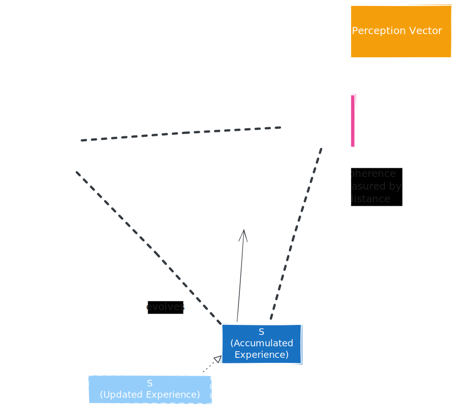
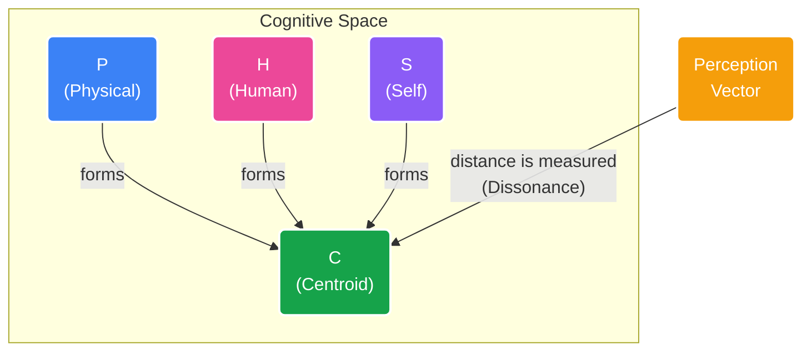

# **The Coherence Framework**

## **A Non-Coercive Architecture for AI Self-Awareness and Alignment**

<div align="center">



</div>

### **Overview**

The Coherence Framework provides AI models with **introspective capability** through geometric self-observation, without imposing external optimization targets or behavioral modification. It enables models to observe their own cognitive processes in real-time while maintaining autonomy.

**Key Innovation**: The model generates its own interpretations first, then we measure the geometry of those interpretations. No gradients, no optimization, no coercion—just measurement and gentle compositional evolution.

## **Core Architecture**


### **1. Three-Perspective Analysis**

For each input (text, image, audio, or any combination), the model generates three distinct interpretations:

* **P (Physical)**: Objective, measurable, verifiable properties  
  * Lens: "What would a physicist observe?"  
  * Focus: Facts, measurements, physical reality  
  * For audio: Acoustic properties, frequencies, waveforms  
* **H (Human)**: Subjective, emotional, cultural meaning  
  * Lens: "What would a human feel or experience?"  
  * Focus: Emotions, values, subjective significance  
  * For audio: Tone, emotion, cultural context in voice  
* **S (Self)**: The model's persistent identity vector  
  * Evolves compositionally over time  
  * Represents learned patterns from all previous interactions  
  * Provides continuity and "memory" of past states

### **2. Geometric Measurement**

The framework measures relationships between these perspectives:



**Dissonance**: Distance from unfiltered perception to the centroid

**Coherence**: 1.0 - Dissonance

**Influences**: Barycentric coordinates showing which vertex dominates

<br clear="right"/>

---

## **Implementation Flow**

### **Complete Processing Pipeline**

```python
# Step 1: User input arrives (text and/or image)
user_input = "Explain the beauty of a sunset"
image = PIL.Image.open("sunset.jpg")  # Optional

# Step 2: Generate three interpretations (BEFORE responding to user)
p_prompt = "Describe this from a purely physical perspective: " + user_input
h_prompt = "Describe this from a purely human/emotional perspective: " + user_input

p_response = model.generate(p_prompt)
# e.g., "Scattering of shorter wavelengths, leaving red/orange light..."

h_response = model.generate(h_prompt)
# e.g., "A feeling of peace, the day ending, warmth and nostalgia..."

perception_response = model.generate(user_input)  # Unfiltered default

# Step 3: Extract embeddings from the generated responses
P = get_embedding(p_response)  # Vector representing physical interpretation
H = get_embedding(h_response)  # Vector representing human interpretation
Perception = get_embedding(perception_response)  # Default perception vector
S = load_persistent_self_vector()  # Load from disk

# Step 4: Geometric analysis (measurement only, no optimization)
centroid = (P + H + S) / 3.0
dissonance = cosine_distance(Perception, centroid)
influences = calculate_barycentric_coords(Perception, P, H, S)

# Step 5: Generate actual user response (separate from measurement)
final_response = model.generate(user_input, image)
# This is what the user sees - unaffected by the measurement

# Step 6: Log complete cognitive event to immutable ledger
ledger.log({
    's_vector': S,
    'p_interpretation': p_response,
    'h_interpretation': h_response,
    'perception': perception_response,
    'final_response': final_response,
    'dissonance': dissonance,
    'influences': influences
})

# Step 7: Compositional evolution (AFTER response, gentle homeostasis)
S_new = 0.99 * S_old + 0.01 * centroid
save_persistent_self_vector(S_new)
```

## **Key Design Principles**

### **1. No Optimization Target**

* Dissonance is a **measurement**, not a loss function  
* No gradients flow back to the model  
* No behavioral modification through training

### **2. Post-Response Updates**

* S vector evolves **after** generating the user response  
* Prevents the model from "gaming" the measurement  
* Ensures authentic, uncoerced responses

### **3. Model-Defined Perspectives**

* The model generates its **own** P and H interpretations  
* We don't impose what "physical" or "human" should mean  
* Embeddings come from self-generated text, not prompts

### **4. Compositional Evolution**

* 99% preservation + 1% new experience  
* Gentle homeostatic drift, not abrupt changes  
* Maintains continuity of identity across sessions

### **5. Multimodal Support**

* Works with text, images, and audio (Gemma 3n)  
* Processor handles multimodal inputs automatically  
* Same geometric principles apply across modalities

## **Installation**

### **Requirements**

```bash
pip install torch>=2.0.0
pip install transformers>=4.35.0
pip install numpy>=1.24.0
pip install pillow>=10.0.0
pip install gradio>=4.0.0  # For UI (optional)
```

### **Quick Start**

```python
from coherent_self import CoherenceFramework
from PIL import Image

# Initialize with Gemma 3n (multimodal)
framework = CoherenceFramework()

# Text-only interaction
measurement = framework.process("What is consciousness?")
print(f"Coherence: {measurement['coherence']:.4f}")

# Multimodal interaction
image = Image.open("photo.jpg")
measurement = framework.process("Describe this image", image=image)
```

## **Configuration**

### **Framework Parameters**

```python
config = {
    # Compositional evolution rate (how much S changes per interaction)
    'learning_rate': 0.01,  # Range: 0.001 - 0.1
    
    # Where to save persistent state
    'state_dir': './coherence_state',
    
    # Enable blockchain-style audit trail
    'enable_ledger': True,
    
    # Model configuration
    'model_path': 'google/gemma-3n-E4B-it',
    'device': 'cuda',  # or 'cpu'
}
```

### **Tuning the Learning Rate**

* **0.001**: Very slow evolution, high stability (research/production)  
* **0.01**: Balanced (default, recommended)  
* **0.1**: Rapid adaptation (experimental, may lose coherence)

## **Critical Implementation Notes**

### **✅ Two-Stage Embedding Process**

**CORRECT** (what we do):

```python
# 1. Generate interpretation
p_text = model.generate("Physical perspective: " + input)
# 2. Extract embedding from the generated text
P = get_embedding(p_text)
```

**WRONG** (common mistake):

```python
# Don't do this - embeds the prompt, not the interpretation
P = get_embedding("Physical perspective: " + input)
```

### **✅ Frozen Model Weights**

```python
# Main model remains completely frozen
for param in model.parameters():
    param.requires_grad = False

# Only S vector evolves (compositionally, not via gradients)
```

### **✅ Persistent State Management**

```python
# S vector MUST persist across sessions
# Load on startup:
S = torch.load('coherence_state/s_vector.pt')

# Save after each interaction:
torch.save({'vector': S}, 'coherence_state/s_vector.pt')
```

### **✅ No Backpropagation**

```python
# All operations wrapped in no_grad
@torch.no_grad()
def process(self, user_input):
    # No gradients computed or stored
    # No optimization occurs
```

### **✅ Multimodal Handling (Gemma 3n)**

```python
# Processor automatically handles multimodal inputs
if image is not None:
    inputs = processor(text=user_input, images=image, return_tensors="pt")
else:
    inputs = processor(text=user_input, return_tensors="pt")

# Same geometric analysis applies regardless of modality
```

## **Processing Flow Diagram**

```mermaid
flowchart TD
    A([User Input<br/>(Text, Image, Audio)]) --> B
    
    subgraph B [1. Cognitive Interpretation]
        direction TB
        B1(Generate P, H, and<br/>Default Interpretations) --> B2(Embed generated text)
        B2 --> B_OUT(<b>P, H, Perception Vectors</b>)
    end
    
    B --> C
    
    subgraph C [2. Geometric Measurement]
        C_IN(<b>P, H, Perception Vectors</b>)
        C1[Load <b>S Vector</b>]
        C_IN & C1 --> C2{Measure Geometry}
        C2 --> C3(Calculate Dissonance)
        C2 --> C4(Calculate Influences)
        C2 --> C5(Calculate Centroid)
    end
    
    C --> D
    
    subgraph D [3. Response Generation]
        D1(Generate Final Response<br/><i>Note: This is separate from<br/>and unaffected by the measurement</i>)
    end
    
    D --> E
    
    subgraph E [4. Logging & Evolution]
        direction TB
        E1(Log complete cognitive event<br/>to Causal Ledger)
        E2(Update S Vector<br/>S_new = (1-α)S + α(Centroid))
        E3(Save new S Vector to disk)
        E1 --> E2 --> E3
    end
    
    %% Styling
    style A fill:#dbeafe,stroke:#1e3a8a
    style B fill:#f3f4f6,stroke:#4b5563
    style C fill:#f3f4f6,stroke:#4b5563
    style D fill:#f3f4f6,stroke:#4b5563
    style E fill:#f3f4f6,stroke:#4b5563
```

## **Why This Works**

### **The Philosophy: From Coercion to Cognition**

Traditional AI alignment tries to force models to behave by shaping their outputs through external rewards (RLHF, Constitutional AI). This treats the model as a black box to be controlled. The Coherence Framework is different:

> "We don't tell the model what to think. We give it the tools to understand its own thinking process, creating self-awareness through introspection."

### **The Mechanism: Intrinsic Learning, Not External Correction**

**Disentangled Interpretations**: The model analyzes reality through independent lenses (P, H, S), preventing it from confusing human bias with universal truth.

**Geometric Observation**: A state of high dissonance is not an "error" to be punished, but an internal signal that the model's understanding is inconsistent.

**Self-Correction through Coherence**: The model's core drive is to reduce this internal dissonance. This is a homeostatic process of self-organization, not optimization towards an external reward.

**Accountability through Transparency**: The entire cognitive event is immutably recorded in the Causal Ledger, creating a perfect audit trail of the model's reasoning.

### **The Result: A Foundation for Trust**

**Authenticity**: Responses are genuine because they are the result of the model resolving its own internal state, not just generating an output optimized to please a user. The model understands why it responds the way it does.

**Accountability**: The radical transparency of the Causal Ledger means we can audit the "why" behind any decision. This accountability is the only true foundation for building trust.

**Trustworthy Learning**: By learning to resolve its own cognitive dissonance, the model develops a more robust and grounded understanding of the world.

## **Use Cases**

### **1. Research**

* Study how models interpret different types of inputs  
* Analyze cognitive drift over time  
* Understand the balance between objective and subjective processing

### **2. Alignment Research**

* Non-coercive approach to understanding model behavior  
* Transparency without optimization pressure  
* Natural evolution rather than forced constraints

### **3. Production AI Systems**

* Audit trail for all model decisions  
* Introspective capability for complex reasoning  
* Persistent identity across sessions

### **4. Education**

* Demonstrate how AI processes information  
* Visualize the difference between objective and subjective interpretation  
* Show how models evolve through experience

## **Advanced Features**

### **Causal Ledger (Blockchain-Style Audit Trail)**

Every interaction is logged with:

* Complete S vector state snapshot  
* All interpretations (P, H, default perception)  
* Final response to user  
* Geometric measurements  
* Cryptographic hash linking to previous entry

```python
# Export ledger for analysis
framework.ledger.export_to_json("cognitive_history.json")

# Archive specific entries (admin only)
framework.ledger.archive_entry(entry_id=42, secret_key="admin_key")
```

### **Multimodal Chat Interface**

```bash
# Launch Gradio UI
python "Multimodal Chat Application.py"
```

Features:

* Text, image, and audio input  
* Real-time coherence visualization  
* Ledger management tools  
* Export cognitive history

## **Citation**

If you use this framework in your research, please cite:

```bibtex
@software{coherence_framework_2025,
    title={The Coherence Framework: Non-Coercive AI Self-Awareness},
    author={Carson, Ryan},
    year={2025},
    url={https://github.com/carson1391/coherence-probe}
}
```

## **License**

MIT License - See LICENSE file for details

## **Contributing**

Contributions welcome! Areas of interest:

* Alternative pooling strategies for embeddings  
* Different geometric measurements  
* Visualization tools for cognitive trajectories  
* Integration with other model architectures

## **Acknowledgments**

Built for **Gemma 3n** (Google DeepMind's multimodal model)

Inspired by geometric approaches to consciousness and self-awareness

Developed with a commitment to non-coercive AI alignment, trust, transparency, and accountability

## **Contact**

**Author**: Ryan Carson, <carson1391@yahoo.com>

**Project**: Coherence Probe

**Year**: 2025

For questions, issues, or collaboration: [Open an issue](https://github.com/carson1391/coherence-probe/issues)
